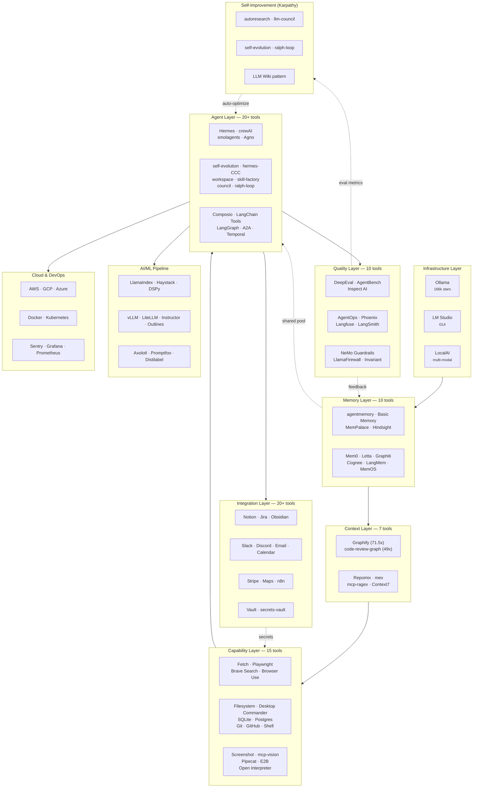

# AI Evolution Stack

> **The Definitive Local-First AI Toolkit for Developers**
>
> 100+ curated tools across 35 categories. At least 2 options per niche.
> One script installs everything. No cloud required (mostly).

---

## Quick Navigation

| Section | Description |
|---------|-------------|
| [Architecture](#architecture) | Full stack map — every category at a glance |
| [Quick Install](#quick-install) | One command to get everything |
| [Tool Catalog](#tool-catalog) | All 22 categories with comparisons |
| [MCP Integration](#mcp-integration) | Unified config for Claude Code, Cursor, LM Studio |
| [Hermes Ecosystem](#15-hermes-ecosystem) | Everything that enhances Hermes Agent |
| [Troubleshooting](#troubleshooting) | Common issues and fixes |

---

## Architecture



> See [docs/architecture-flow.md](docs/architecture-flow.md) for a detailed diagram of how all layers interconnect.

---

## Quick Install

### macOS / Linux

```bash
git clone https://github.com/Yousifus/ai-evolution-stack.git
cd ai-evolution-stack && chmod +x install.sh && ./install.sh
```

### Windows (PowerShell)

```powershell
git clone https://github.com/Yousifus/ai-evolution-stack.git
cd ai-evolution-stack; .\install.ps1
```

The installer is interactive — choose "Everything" or pick categories individually.

### Install Flags

```bash
# macOS/Linux
./install.sh --everything         # All 60+ tools
./install.sh --core               # Memory + Context + Code Search
./install.sh --memory             # All 10 memory systems
./install.sh --web                # Web & Browser tools
./install.sh --database           # Database MCPs
./install.sh --agents             # Agent frameworks + orchestration
./install.sh --hermes             # Full Hermes ecosystem
./install.sh --inference          # Ollama + LocalAI
./install.sh --capabilities       # Skills, code exec, voice, browser
./install.sh --observability      # Monitoring + eval + guardrails
./install.sh --verify             # Check what's installed
```

---

## Tool Catalog

### 1. Memory Layer

10 memory systems — from simple key-value to temporal knowledge graphs.

#### Core Memory

| Tool | Install | Storage | Best For |
|------|---------|---------|----------|
| **agentmemory** | `npm i -g @agentmemory/agentmemory` | ChromaDB | Universal memory across all AI tools |
| **Basic Memory** | `pip install basic-memory` | Markdown files | Human-readable, git-friendly memory |
| **MemPalace** | `pip install mempalace` | ChromaDB | Claude Code conversation recall |
| **Hindsight** | `pip install hindsight-server` | SQLite | Knowledge graph + semantic search |
| **MemClaw** | `pip install memclaw` | SQLite | **Per-project isolated** workspaces — zero cross-project bleed |

#### Advanced Memory (new)

| Tool | Install | Stars | Superpower |
|------|---------|-------|------------|
| **Mem0** | `pip install mem0ai` | 52k | Auto-consolidation, dedup, conflict resolution. Drop-in universal memory. |
| **Letta** (ex-MemGPT) | `pip install letta` | 22k | Self-editable memory blocks. Agent rewrites its own memory. `.af` versioned state files. |
| **Graphiti** (Zep) | `pip install graphiti-core` | 5k | Temporal knowledge graph — facts have validity windows. "What did I know at time X?" |
| **Cognee** | `pip install cognee` | 15k | Auto-prunes stale nodes, strengthens frequent connections. Has Claude Code MCP plugin. |
| **LangMem** | `pip install langmem` | 3k | **Procedural memory** — agent rewrites its own system prompt from feedback. |
| **MemOS** | `pip install memos` | -- | Multi-agent shared memory pool. 72% lower token usage. |

#### Memory Decision Matrix

| Need | Pick This |
|------|-----------|
| Drop-in, just works | **Mem0** |
| Agent edits its own memory | **Letta** |
| Facts that change over time | **Graphiti** |
| Auto-consolidation | **Cognee** |
| Agent rewrites its own prompt | **LangMem** |
| Multi-agent shared pool | **MemOS** |
| Human-readable files | **Basic Memory** |
| Claude Code specific | **MemPalace** |
| Per-project isolation | **MemClaw** |

---

### 2. Project Context & Codebase Intelligence

| Tool | Install | What It Does |
|------|---------|-------------|
| **Graphify** | `pip install graphifyy && graphify install` | **71.5x token reduction.** Compiles folders into knowledge graphs (AST for 20 langs, PDFs, images, video). Query the graph, not raw files. Karpathy LLM Wiki pattern as working code. |
| **Repomix** | `npm i -g repomix` | Packages entire codebase for AI — 70% token reduction via tree-sitter compression |
| **mex** | `npm i -g mex-cli` | Living docs that detect drift from code |
| **Claude Context** | Via plugins | Hybrid code search |
| **code-review-graph** | `pip install code-review-graph` | 49x token reduction. SQLite-backed structural map of your codebase. |

---

### 3. Code Search & Navigation

| Tool | Install | Search Modes |
|------|---------|-------------|
| **mcp-ragex** | `pip install mcp-ragex` | RAG (vector) + AST (tree-sitter) + regex (ripgrep) |
| **Repomix** | `npm i -g repomix` | Full codebase packaging (dual-use) |

---

### 4. Web & Browser

| Tool | Install | What It Does | API Key? |
|------|---------|-------------|----------|
| **Fetch MCP** | `npx @modelcontextprotocol/server-fetch` | Fetch URLs, HTML-to-Markdown | No |
| **Playwright MCP** | `npx @playwright/mcp@latest` | Full browser automation (Microsoft) | No |
| **Brave Search** | `npx @brave/mcp-server` | Web/image/news search | Yes (free) |
| **Browser Use** | `pip install browser-use` | Agent-native Chromium control (72k stars) | No |

---

### 5. File System

| Tool | Install | Scope |
|------|---------|-------|
| **Filesystem MCP** | `npx @modelcontextprotocol/server-filesystem /path` | Sandboxed file ops |
| **Desktop Commander** | `npx @wonderwhy-er/desktop-commander` | File + terminal + process (all-in-one) |

---

### 6. Database

| Tool | Install | Access |
|------|---------|--------|
| **SQLite MCP** | `uvx mcp-server-sqlite --db-path ./db.sqlite` | Read + Write |
| **Postgres MCP** | `npx @modelcontextprotocol/server-postgres $CONN` | Read-only (safe for prod) |

---

### 7. Git & GitHub

| Tool | Install | Scope |
|------|---------|-------|
| **Git MCP** | `uvx mcp-server-git` | Local repo: log, diff, blame, branches |
| **GitHub MCP** | [Setup guide](#github-mcp-setup) | PRs, issues, code search, Actions |

---

### 8. Terminal & Shell

| Tool | Install | Security |
|------|---------|----------|
| **Desktop Commander** | `npx @wonderwhy-er/desktop-commander` | Broad access |
| **mcp-shell-server** | `pip install mcp-shell-server` | Whitelisted commands only |

---

### 9. Image & Vision

| Tool | Install | Cloud? |
|------|---------|--------|
| **Screenshot MCP** | `pip install screenshot-mcp-server` | No |
| **mcp-vision** | [GitHub](https://github.com/MikeyBeez/mcp-vision) | No (Ollama local) |

---

### 10. Task & Project Management

| Tool | Install | Platform |
|------|---------|----------|
| **Notion MCP** | Official integration | Notion |
| **Jira MCP** | `pip install jira-mcp-server` | Jira Cloud |

---

### 11. Security & Secrets

| Tool | Install | Scope |
|------|---------|-------|
| **mcp-secrets-vault** | `pip install mcp-secrets-vault` | Local mini-vault — AI never sees keys |
| **Vault MCP** | HashiCorp setup | Enterprise secret management |

---

### 12. Knowledge & Docs

| Tool | Install | What It Does |
|------|---------|-------------|
| **Context7** | Via Cursor/Claude plugins | Up-to-date library documentation |
| **HF Skills** | `pip install huggingface-skills` | ACP skill definitions for ML tasks (datasets, training, eval) |

---

### 13. Personal Evolution

| Tool | Install | What It Does |
|------|---------|-------------|
| **homunculus** | `git clone` + `pip install -e .` | Learns YOUR coding patterns over time |
| **Hermes Agent** | `pip install hermes-agent` | Self-improving agent that creates skills from experience |

---

### 14. Local Inference

| Tool | Install | Interface | Stars |
|------|---------|-----------|-------|
| **Ollama** | `curl -fsSL https://ollama.ai/install.sh \| sh` | CLI + REST API | 166k |
| **LM Studio** | Download from lmstudio.ai | GUI + REST API | -- |
| **LocalAI** | Docker / binary | REST API (OpenAI drop-in) | 30k+ |
| **hf-agents** | `pip install hf-agents` | CLI (auto-detects hardware, picks model) | -- |

---

### 15. Hermes Ecosystem

Everything that extends or enhances Hermes Agent.

| Tool | What It Does | Source |
|------|-------------|--------|
| **hermes-agent-self-evolution** | Auto-optimizes skills via DSPy + genetic prompt evolution (~$2-10/run) | NousResearch official |
| **hermes-CCC** | 46 native skills ported to Claude Code — no daemon, no OAuth | AlexAI-MCP |
| **hermes-workspace** | Browser GUI: chat, terminal, memory browser, skills manager | 1.2k stars |
| **awesome-hermes-agent** | Canonical curated list of all Hermes tools, skills, configs | 1.1k stars |
| **hermes-skill-factory** | Auto-generates reusable skills from your own workflows | Community |
| **hermes-council** | Adversarial multi-perspective debate MCP server | Community |

#### Hermes Tips (from Reddit/community)

- Enable **Honcho** explicitly — it's off by default, self-learning won't work without it
- Create `AGENTS.md` in project root with architecture notes
- Use `hermes doctor` for config diagnostics
- **Never** set `GATEWAY_ALLOW_ALL_USERS=true` if terminal access is enabled
- Power-user pattern: use OpenClaw as orchestrator, Hermes as executor
- Self-evaluation is unreliable — pair with DeepEval or manual checkpoints

#### Hermes Skill Packs

| Pack | What It Contains |
|------|-----------------|
| **wondelai/skills** | 380+ general-purpose cross-platform skills |
| **Anthropic-Cybersecurity-Skills** | 753+ MITRE ATT&CK-mapped security skills |
| **chainlink-agent-skills** | Solana/Oracle data and smart contract tools |
| **Skills Hub** (official) | Browse at hermes-agent.nousresearch.com/docs/skills |

---

### 16. Agent Frameworks

| Tool | Install | Stars | Best For |
|------|---------|-------|----------|
| **Hermes Agent** | `pip install hermes-agent` | 62k | Self-improving personal agent |
| **crewAI** | `pip install crewai` | 46k | Role-based multi-agent teams |
| **smolagents** (HuggingFace) | `pip install smolagents` | 26k | Code-first agents that write+execute Python |
| **Agno** (ex-Phidata) | `pip install agno` | -- | Batteries-included agent apps with built-in UI |
| **claude-flow** | `npm i -g claude-flow` | -- | Claude-native swarm: 87 MCP tools, hive-mind, peer-to-peer messaging |
| **workflow-orchestration** | `git clone` + `./setup.sh` | -- | 8 specialist agents with auto task decomposition |

---

### 17. Agent Skills & Tools

Pre-built tool collections that give agents real-world capabilities.

| Tool | Install | What It Gives Agents |
|------|---------|---------------------|
| **Composio** | `pip install composio-core` | 250+ pre-built SaaS tools (GitHub, Slack, Linear, Gmail, Jira) |
| **LangChain Tools** | `pip install langchain langchain-community` | 100+ built-in tools (search, SQL, file I/O, APIs) |
| **Browser Use** | `pip install browser-use` | Agent-native Chromium browser control (72k stars) |

---

### 18. Code Execution

Secure environments for agents to write and run code.

| Tool | Install | Where It Runs |
|------|---------|--------------|
| **E2B** | `pip install e2b-code-interpreter` | Cloud sandboxes (isolated Linux VMs) |
| **Open Interpreter** | `pip install open-interpreter` | Local machine (Python, JS, shell) |

---

### 19. Voice & Audio

#### Speech-to-Text (STT / Hearing)

| Tool | Install | What It Does |
|------|---------|-------------|
| **faster-whisper** | `pip install faster-whisper` | 4x faster than OpenAI Whisper. CTranslate2 backend. CPU-friendly. |
| **whisper-mcp** | `pip install whisper-mcp` | MCP server for Claude Code — transcribe audio files locally via whisper.cpp |
| **Fast-Whisper-MCP** | [GitHub](https://github.com/BigUncle/Fast-Whisper-MCP-Server) | High-performance MCP server based on faster-whisper |
| **whisper-live** | `pip install whisper-live` | Real-time streaming transcription. Speak and see text instantly. |

#### Text-to-Speech (TTS / Speaking)

| Tool | Install | What It Does |
|------|---------|-------------|
| **Kokoro** | `pip install kokoro` | 82M params, 54 voices, 8 languages. ~90x realtime on consumer GPU. High quality. |
| **claude-tts-mcp** | [GitHub](https://github.com/mitchthestonky/claude-tts-mcp) | Kokoro-based MCP for Claude Code. Free, offline, no API keys. |
| **Coqui TTS** | `pip install coqui-tts` | Voice cloning with 6-second sample. XTTS v2. 16 languages. |
| **Bark** | `pip install suno-bark` | Expressive TTS — laughter, music, sound effects. Suno AI. |

#### Full Voice Pipelines

| Tool | Install | What It Does |
|------|---------|-------------|
| **Pipecat** | `pip install pipecat-ai` | Real-time voice pipeline: STT + LLM + TTS (<1s latency) |
| **voice-mcp** | [GitHub](https://github.com/jochiang/voice-mcp) | Combined STT (Whisper) + TTS (Supertonic) MCP for Claude Code |
| **Hermes Voice** | `pip install "hermes-agent[voice]"` | Voice support built into Hermes Agent |

---

### 20. Agent Orchestration

Coordinate multiple agents, durable workflows, agent-to-agent communication.

| Tool | Install | Stars | What It Does |
|------|---------|-------|-------------|
| **LangGraph** | `pip install langgraph` | 35k | Stateful graph-based agent orchestration. Best observability via LangSmith. |
| **A2A Protocol** | [GitHub](https://github.com/a2aproject/A2A) | 10k | Google/Linux Foundation open protocol — agents discover and call each other over HTTP. |
| **Temporal** | `pip install temporalio` | -- | Durable execution — workflows survive crashes, auto-retry, checkpoint at every step. |

---

### 21. Agent Evaluation

Test and benchmark your agents.

| Tool | Install | What It Does |
|------|---------|-------------|
| **DeepEval** | `pip install deepeval` | pytest-style agent evals. 50+ metrics. CI/CD integration. |
| **AgentBench** | [GitHub](https://github.com/THUDM/AgentBench) | 8 task domains (OS, DB, web, knowledge graphs). Real interactive environments. |
| **Inspect AI** | `pip install inspect-ai` | UK AI Safety Institute. Task-based eval with sandboxed tool execution. |

---

### 22. Agent Guardrails

Safety, security, and constraint enforcement for agents.

| Tool | Install | What It Does |
|------|---------|-------------|
| **NeMo Guardrails** | `pip install nemoguardrails` | NVIDIA. Programmable safety rails via Colang DSL. Proxy microservice pattern. |
| **LlamaFirewall** | [GitHub](https://github.com/meta-llama/PurpleLlama) | Meta. Prompt injection detection + chain-of-thought auditing + CodeShield. |
| **Invariant** | [GitHub](https://github.com/invariantlabs-ai/invariant) | Runtime guardrails. Policy enforcement for agent actions. |

---

### 23. Agent Observability

Monitor, debug, and trace agent behavior.

| Tool | Install | Open Source? | Best For |
|------|---------|-------------|----------|
| **AgentOps** | `pip install agentops` | SDK (hosted backend) | Full lifecycle tracking, tool calls, self-correction loops |
| **Arize Phoenix** | `pip install arize-phoenix` | Yes (fully local) | Local-first debugging. OpenInference standard. RAG + agent traces. |
| **Langfuse** | `pip install langfuse` | Yes (self-hostable) | Teams wanting full data ownership |
| **LangSmith** | `pip install langsmith` | SDK (hosted backend) | Native LangGraph traces. Best for LangChain ecosystem. |

---

## MCP Integration

### Complete Claude Code Config

Copy `mcp.json` from this repo to `~/.claude/mcp.json`, or run:

```bash
./install.sh --mcp     # macOS/Linux
.\install.ps1 -MCP     # Windows
```

### MCP Servers Included

| Server | Category | Transport |
|--------|----------|-----------|
| agentmemory | Memory | npx |
| basic-memory | Memory | uvx/pip |
| hindsight | Memory | pip |
| mempalace | Memory | pip |
| repomix | Context | npx |
| mcp-ragex | Code Search | pip |
| fetch | Web | npx |
| playwright | Browser | npx |
| brave-search | Search | npx |
| filesystem | File System | npx |
| desktop-commander | File + Terminal | npx |
| sqlite | Database | uvx |
| postgres | Database | npx |
| git | Git | uvx |
| github | GitHub | HTTP |
| mcp-shell-server | Terminal | pip |
| screenshot | Vision | pip |
| secrets-vault | Security | pip |
| hermes | Agent | pip |
| cognee | Memory (advanced) | pip |

---

## Setup Guides

### GitHub MCP Setup

```bash
# Generate PAT at https://github.com/settings/tokens (scopes: repo, read:org)
claude mcp add github \
  --transport http \
  --url https://api.githubcopilot.com/mcp/ \
  --header "Authorization: Bearer YOUR_PAT"
```

### Hermes Agent Setup

```bash
# Install
pip install hermes-agent

# macOS/Linux alternative:
curl -fsSL https://raw.githubusercontent.com/NousResearch/hermes-agent/main/scripts/install.sh | bash

# Configure local inference
hermes config set provider ollama
hermes config set provider.ollama.base_url http://localhost:11434

# Run as MCP server
hermes mcp serve

# Enable self-learning (OFF by default!)
hermes config set honcho.enabled true

# Check config
hermes doctor
```

### Ollama Setup

```bash
curl -fsSL https://ollama.ai/install.sh | sh
ollama pull qwen2.5-coder:7b      # Coding
ollama pull nomic-embed-text       # Embeddings
ollama pull llava                  # Vision
```

### Brave Search Setup

```bash
# Get free API key: https://brave.com/search/api/
# Add to mcp.json env: BRAVE_API_KEY
```

For all other tools, see the `docs/` folder.

---

### 24. Self-Improvement (Karpathy-inspired)

Tools and patterns for agents that improve themselves.

| Tool | Install | Stars | What It Does |
|------|---------|-------|-------------|
| **autoresearch** | `git clone` + `uv sync` | -- | Karpathy's autonomous ML research agent. Modifies code, runs experiments, evaluates, iterates. The canonical self-improving loop. |
| **llm-council** | `git clone` + `uv sync` + `npm install` | 16.9k | Multi-LLM council: routes query to multiple models, peer-review, chairman synthesizes. Multi-perspective deliberation. |
| **hermes-agent-self-evolution** | `git clone` + `pip install -e .` | -- | DSPy + genetic prompt evolution for auto-optimizing Hermes skills. |
| **ralph-loop** | Claude Code plugin | -- | Iterative loop: same prompt fed repeatedly, agent sees its own edits, improves each cycle. |

#### Karpathy's LLM Wiki Pattern

Not a tool but a design pattern (from [this gist](https://gist.github.com/karpathy/442a6bf555914893e9891c11519de94f)):
Replace RAG with an **LLM-maintained wiki**. Three operations:
- **Ingest**: LLM summarizes new sources into structured wiki pages
- **Query**: Answer questions from compiled wiki with citations
- **Lint**: Detect contradictions, staleness, gaps — self-reflection

The pattern can be implemented with Basic Memory (Markdown files) + Cognee (auto-prune) + any LLM.

---

### 25. Notifications & Messaging

| Tool | Install | Platform |
|------|---------|----------|
| **Slack MCP** | `npx @korotovsky/slack-mcp-server` | Slack (DMs, channels, threads, reactions) |
| **Discord MCP** | `npx mcp-discord` | Discord (messages, channels, roles, moderation) |
| **Email MCP** | `pip install mcp-email-server` | IMAP + SMTP (any email provider) |

---

### 26. Calendar & Scheduling

| Tool | Install | What It Does |
|------|---------|-------------|
| **Google Calendar MCP** | `npx google-calendar-mcp` | Multi-account, create/update/delete events, free/busy queries |

---

### 27. Document & PDF

| Tool | Install | What It Does |
|------|---------|-------------|
| **Markdown2PDF MCP** | `npx markdown2pdf-mcp` | Markdown to PDF with syntax highlighting, custom styling |
| **Unstructured** | `pip install unstructured[all-docs]` | Extract content from PDFs, Word, HTML, images with OCR |

---

### 28. Data & Analytics

| Tool | Install | What It Does |
|------|---------|-------------|
| **Excel MCP** | `npx @negokaz/excel-mcp-server` | Read/write MS Excel — no Excel install required |

---

### 29. Cloud & Infrastructure

| Tool | Install | Provider |
|------|---------|----------|
| **AWS MCP** (official) | `uvx awslabs.core-mcp-server` | S3, Lambda, EKS, Bedrock, 20+ services |
| **GCP MCP** (official) | See googleapis/gcloud-mcp | BigQuery, GCE, GKE, Maps |
| **Azure MCP** (official) | See microsoft/mcp | 40+ Azure services |
| **Docker MCP** | `npx @modelcontextprotocol/server-docker` | Container, image, volume management |
| **Kubernetes MCP** | Go binary from containers/kubernetes-mcp-server | Native K8s API, supports OpenShift |

---

### 30. Monitoring & Alerting

| Tool | Install | What It Monitors |
|------|---------|-----------------|
| **Sentry MCP** (official) | `npx @sentry/mcp-server` | Error triage, stack traces, issue lookup |
| **Grafana MCP** (official) | Go binary from grafana/mcp-grafana | PromQL queries, dashboards, incidents |
| **Prometheus MCP** | `pip install prometheus-mcp-server` | Metric analysis, alerting |

---

### 31. Design

| Tool | Install | What It Does |
|------|---------|-------------|
| **Figma MCP** | `npx figma-context-mcp` | Read Figma designs, layout data for AI coding agents |

---

### 32. Knowledge Management

| Tool | Install | What It Does |
|------|---------|-------------|
| **Obsidian MCP** | `npx obsidian-mcp-server` | Read/write/search Obsidian vault notes, tags, frontmatter |

---

### 33. RAG & Search Frameworks

End-to-end retrieval-augmented generation — beyond simple vector search.

| Tool | Install | Stars | What It Does |
|------|---------|-------|-------------|
| **LlamaIndex** | `pip install llama-index` | 47k | Ingest 160+ formats, chunk, index, retrieve, generate. The RAG standard. |
| **Haystack** | `pip install haystack-ai` | 24k | Modular pipeline builder for production RAG and semantic search. |
| **DSPy** (Stanford) | `pip install dspy` | 33k | Replaces prompt engineering with compiled, optimizable programs. |

---

### 34. AI/ML Pipeline

Tools for fine-tuning, model serving, structured output, and prompt management.

| Tool | Install | Stars | What It Does |
|------|---------|-------|-------------|
| **vLLM** | `pip install vllm` | 76k | High-throughput model serving. PagedAttention. The production standard. |
| **LiteLLM** | `pip install litellm` | 42.7k | Unified proxy for 100+ LLM providers. Cost tracking, fallbacks, load balancing. |
| **Instructor** | `pip install instructor` | 11k | Pydantic-validated structured output from any LLM. Auto-retries on schema failure. |
| **Outlines** | `pip install outlines` | 11.8k | Guaranteed structured output via constrained decoding during generation. |
| **Axolotl** | `pip install axolotl` | 11.7k | Config-driven fine-tuning: LoRA, QLoRA, DPO, RLHF. One YAML = one training run. |
| **Promptfoo** | `npm i -g promptfoo` | 10.8k | CLI prompt testing, A/B eval, red-teaming. CI/CD-friendly. |
| **Distilabel** | `pip install distilabel` | 3k | Synthetic data generation for fine-tuning datasets. |
| **Argilla** | `pip install argilla` | 4k | Collaborative data labeling UI for RLHF, NER, classification. |

---

### 35. Vector Databases (MCP)

| Tool | Install | What It Does |
|------|---------|-------------|
| **Chroma MCP** (official) | `uvx chroma-mcp` | Vector search, document storage, full-text search |
| **Qdrant MCP** (official) | `uvx mcp-server-qdrant` | Semantic memory layer on Qdrant |

---

### 36. Workflow Automation

| Tool | Install | What It Does |
|------|---------|-------------|
| **n8n MCP** | `npx n8n-mcp` | Build and manage n8n workflows from Claude |

---

### 37. Payments & Finance

| Tool | Install | What It Does |
|------|---------|-------------|
| **Stripe MCP** (official) | `npx -y @stripe/mcp --api-key=KEY` | Payments, subscriptions, invoices |

---

### 38. Maps & Location

| Tool | Install | What It Does |
|------|---------|-------------|
| **Google Maps MCP** | See cablate/mcp-google-map | Places, routing, geocoding (18 tools) |

---

## Curated Reference Lists

These "awesome" lists are goldmines for discovering more tools:

| List | What It Covers |
|------|---------------|
| **awesome-hermes-agent** | Full Hermes ecosystem — skills, GUIs, infra, MCP |
| **awesome-ai-agents-2026** | 300+ resources, 20+ categories, monthly updates |
| **e2b-dev/awesome-ai-agents** | Comprehensive long-running agent catalog |
| **awesome-mcp-servers** | Every known MCP server, categorized |
| **best-of-mcp-servers** | Weekly-updated ranked MCP server list |

---

## Repository Structure

```
ai-evolution-stack/
+-- README.md                     # This file (the definitive reference)
+-- QUICKSTART.md                 # 5-minute setup guide
+-- install.sh                    # macOS/Linux installer (all 60+ tools)
+-- install.ps1                   # Windows installer (all 60+ tools)
+-- mcp.json                      # Complete MCP server configuration
+-- LICENSE
+-- docs/
|   +-- agentmemory.md            # agentmemory deep dive
|   +-- basic-memory.md           # Basic Memory deep dive
|   +-- homunculus.md             # homunculus deep dive
|   +-- lm-studio.md             # LM Studio deep dive
|   +-- mex.md                    # mex deep dive
|   +-- hermes.md                 # Hermes Agent guide
|   +-- ollama.md                 # Ollama guide
|   +-- web-browser.md            # Fetch + Playwright + Brave
|   +-- database.md               # SQLite + Postgres MCP
|   +-- git-github.md             # Git + GitHub MCP
|   +-- security.md               # Vault + secrets-vault
|   +-- hermes-ecosystem.md       # Full Hermes ecosystem guide
|   +-- advanced-memory.md        # Mem0, Letta, Graphiti, Cognee, LangMem, MemOS
|   +-- agent-capabilities.md     # Composio, Browser Use, E2B, Open Interpreter, Pipecat
|   +-- orchestration.md          # LangGraph, A2A, Temporal
|   +-- evaluation.md             # DeepEval, AgentBench, Inspect AI
|   +-- guardrails.md             # NeMo, LlamaFirewall, Invariant
|   +-- observability.md          # AgentOps, Phoenix, Langfuse, LangSmith
+-- examples/
|   +-- claude-mcp.json           # Claude Code config
|   +-- cursor-mcp.json           # Cursor config
|   +-- lmstudio-mcp.json        # LM Studio config
+-- scripts/
|   +-- update-all.sh             # Update all installed tools
|   +-- verify-install.sh         # Verify installation status
```

---

## Update All Tools

```bash
./scripts/update-all.sh
```

---

## Troubleshooting

| Issue | Solution |
|-------|----------|
| MCP server not found | Check PATH, restart terminal |
| Permission denied | `chmod +x install.sh` |
| Port conflicts | Stop conflicting services or change ports in config |
| Ollama model not loading | Run `ollama serve` first |
| Brave Search 401 | Check `BRAVE_API_KEY` |
| GitHub MCP auth failed | Regenerate PAT with correct scopes |
| Hermes self-learning not working | Enable Honcho: `hermes config set honcho.enabled true` |
| Memory not persisting | Check file/DB permissions |
| Windows: python3 not found | Use `python` instead |
| Desktop Commander hangs | `npx @wonderwhy-er/desktop-commander stop` |
| Agent eval tests failing | Check model access and API keys |

---

## Contributing

Found a new tool? Open a PR! The goal: **every category anyone might ever need**.

When adding a tool:
1. Add to the relevant category table in README
2. Add install function to `install.sh` and `install.ps1`
3. Add MCP config to `mcp.json` if applicable
4. Add a doc file in `docs/` for detailed setup

---

## License

MIT - Use however you want. Keep it local. Stay private.

---

**The definitive AI toolkit. Made for builders.**
