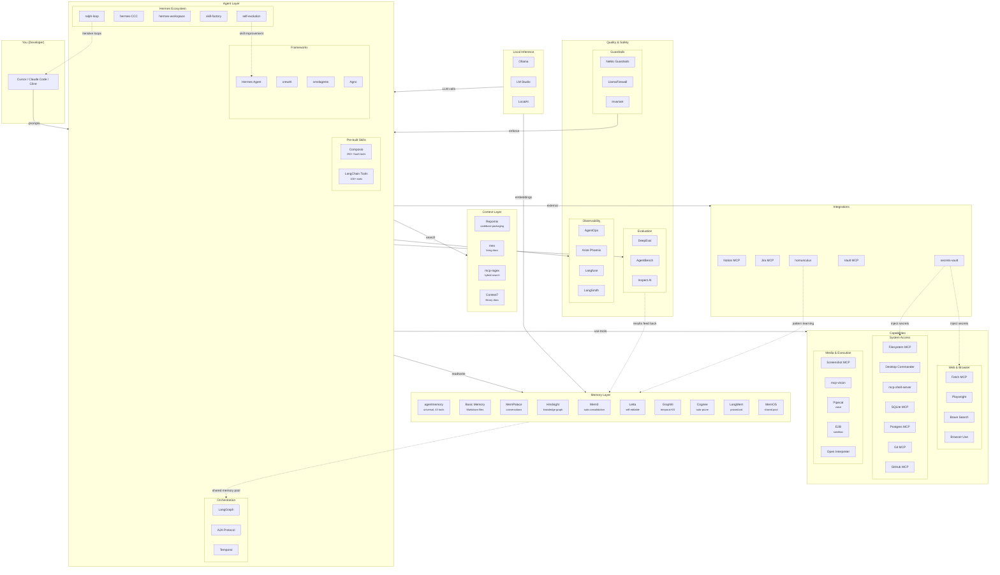
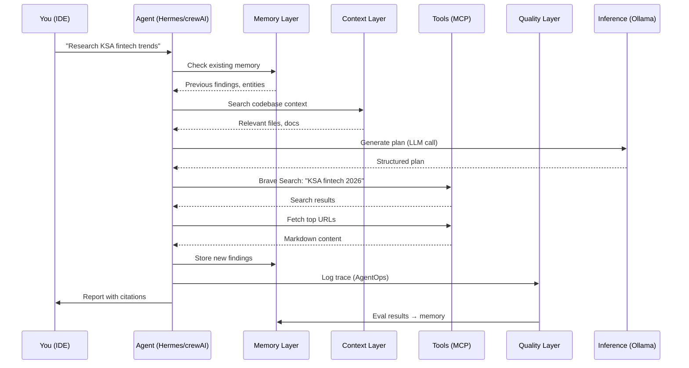
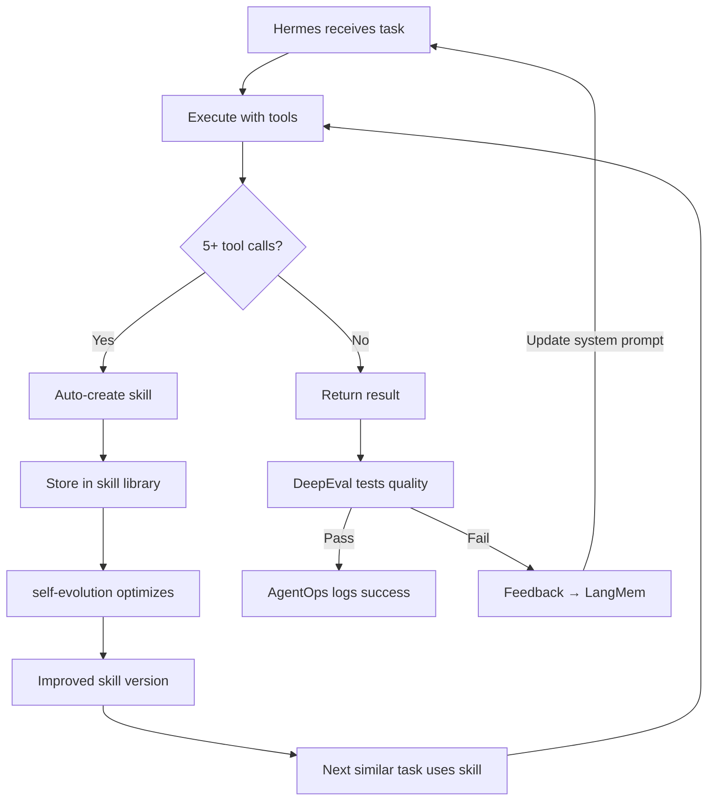

# Architecture Flow

> How all layers in the AI Evolution Stack talk to each other.

## Layer Interconnection Map

## Data Flow Summary

### How a typical agent request flows:

### How memory layers interact:

```mermaid
flowchart LR
    subgraph SHORT["Short-Term"]
        S1["Active conversation"]
        S2["Current tool calls"]
    end

    subgraph MID["Mid-Term"]
        M1["agentmemory<br/><small>session memory</small>"]
        M2["Basic Memory<br/><small>Markdown notes</small>"]
    end

    subgraph LONG["Long-Term"]
        L1["Mem0<br/><small>consolidated facts</small>"]
        L2["Graphiti<br/><small>temporal KG</small>"]
        L3["Hindsight<br/><small>knowledge graph</small>"]
    end

    subgraph META["Meta-Memory"]
        X1["LangMem<br/><small>procedural: how to act</small>"]
        X2["Cognee<br/><small>auto-prune stale</small>"]
        X3["Letta<br/><small>self-editable blocks</small>"]
    end

    SHORT -->|"extract"| MID
    MID -->|"consolidate"| LONG
    LONG -->|"reflect"| META
    META -.->|"update behavior"| SHORT
```

### How Hermes self-improvement works:

## Layer Responsibilities

| Layer | Role | Reads From | Writes To |
|-------|------|-----------|-----------|
| **Infrastructure** | Run LLMs locally | -- | Embeddings, completions |
| **Memory** | Remember across sessions | All layers | Retrieval results |
| **Context** | Understand current codebase | File system | Packaged context |
| **Capabilities** | Interact with the world | Web, DBs, files, APIs | Action results |
| **Agent** | Reason, plan, execute | Memory + Context + Capabilities | Actions, memory updates |
| **Quality** | Test, monitor, constrain | Agent traces | Eval results, alerts |
| **Integrations** | Connect to external tools | Agent requests | External system updates |
